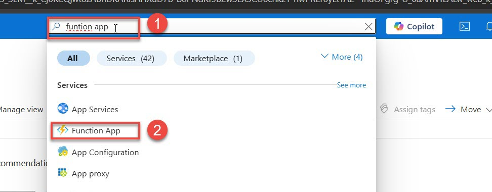
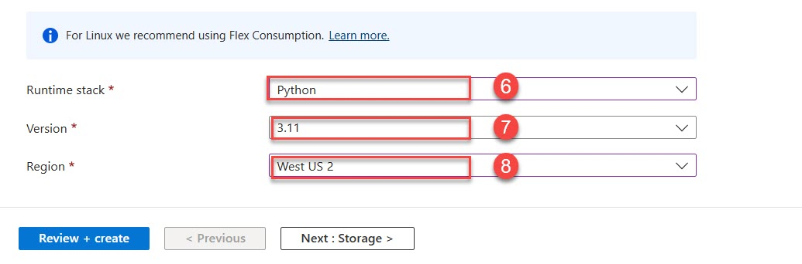

#  Lab Guide: Creating an Azure Function with Blob Trigger (Python)

##  Objective

Create and test an **Azure Function** using a **Blob Trigger** in Python. The function will execute automatically whenever a new blob is added to a specific container in Azure Storage.

---

##  Prerequisites

- Active **Azure subscription**
- Basic understanding of Python
- Access to [Azure Portal](https://portal.azure.com)

---

## 🔹 Step 1: Log in to Azure Portal

1. Open a web browser and go to: [https://portal.azure.com](https://portal.azure.com)
2. Sign in using your Azure credentials.

---

## 🔹 Step 2: Create a Function App with Python Runtime

1. In the top search bar, type **Function App**, and click on it.

2. Click **+ Create**


4. Under the **Basics** tab:
   - **Subscription**: Select your subscription
   - **Resource Group**: Click **Create new** or select an existing one (e.g., `blobtrigger-rg`)
   - **Function App name**: Enter a globally unique name (e.g., `blobfuncpython2025`)
   - **Region**: Choose your closest region (e.g., `Central India`)
   - **Runtime stack**: Select `Python`
   - **Version**: Select `3.9`
   - **Operating System**: Select `Windows` or `Linux`
   - **Plan type**: Choose `Consumption (Serverless)`
   
   
5. Click **Next: storage**
   - You will be prompted to create a **Storage account** — this will be used by your Function App.
   - Accept the default name or modify it (e.g., `blobfuncstorage2025`)
   
6. Click **Next: Monitoring** → Leave settings as-is (disable Application Insights if not needed)
7. Click **Review + create** → After validation, click **Create**


8. Wait for deployment → Click **Go to resource**


---

## 🔹 Step 3: Add a Blob Trigger Function

1. In your newly created Function App, on the left panel, click **Functions**
2. Click **+ Add**
3. Under the **Development Environment**, choose **Develop in Portal**

4. Under **Template**, select **Azure Blob Storage trigger**
6. Fill in the details:
   - **Function name**: `BlobTriggerPython`
   - **Path**: Leave blank for now (you’ll edit it after creating the container)
   - **Storage account connection**: Select the auto-generated Storage Account (e.g., `blobfuncstorage2025`)
7. Click **Create**


📌 *Note: The container you want to monitor (e.g., `sample-container`) doesn't exist yet, but we’ll create it next.*

---

## 🔹 Step 4: Create a Container in the Linked Storage Account

1. In the Azure Portal, use the top search bar to find and open your **Storage Account** (e.g., `blobfuncstorage2025`)
2. On the left menu, click **Containers**
3. Click **+ Container**
4. Enter a name (e.g., `sample-container`)
5. Set **Public access level** to `Private (no anonymous access)`
6. Click **Create**


---

## 🔹 Step 5: Update the Trigger Path (if needed)

If you left the **Blob path** blank or entered the wrong name earlier:

1. Go back to your **Function App** → **Functions** → Click on `BlobTriggerPython`
2. Click **Integration** from the left panel
3. Under **Trigger**, change the **Path** to:  
   ```
   sample-container/{name}
   ```
4. Click **Save**

---

## 🔹 Step 6: Review & Edit the Python Code

1. Go to your function `BlobTriggerPython` → Click **Code + Test**
2. You’ll see default code like this:

```python
import logging
import azure.functions as func

def main(myblob: func.InputStream):
    logging.info(f"Python blob trigger function processed blob \n"
                 f"Name: {myblob.name}\n"
                 f"Blob Size: {myblob.length} bytes")
```

---

## 🔹 Step 7: Test the Blob Trigger Function

1. Go back to your **Storage Account** → **Containers** → Click `sample-container`
2. Click **Upload** → Select a file (e.g., `testfile.txt`) → Click **Upload**
3. Go back to your **Function App** → **Functions** → Click `BlobTriggerPython`
4. Click **Monitor** from the left panel
5. You should see output like:

```
---

## ✅ Summary

- Deployed a Python-based Azure Function
- Automatically provisioned a Storage Account
- Added a container manually after deployment
- Connected the Blob Trigger to monitor that container
- Verified function execution through log output

---
