# Azure Logic App Lab Guide: Sending Email Using Recurrence Trigger

## Objective

Create an Azure Logic App that triggers on a schedule (recurrence) and sends an email using a Gmail account.

---

## Prerequisites

* Azure subscription
* Gmail account
* Basic knowledge of Azure Portal

---

## Step-by-Step Instructions

### Step 1: Sign In to Azure Portal

1. Go to [https://portal.azure.com](https://portal.azure.com)
2. Sign in with your Azure credentials

   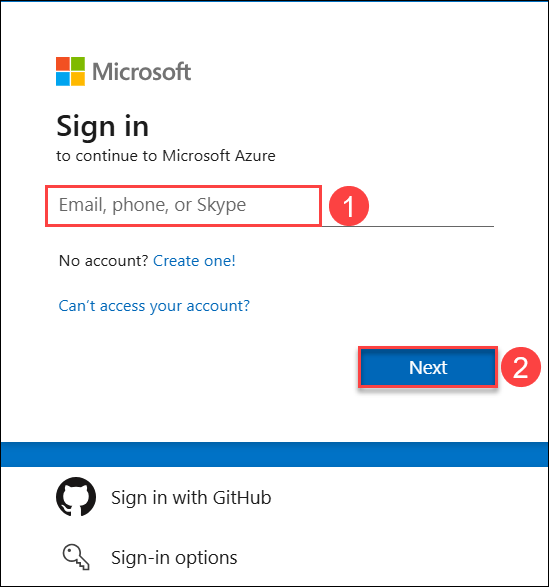

   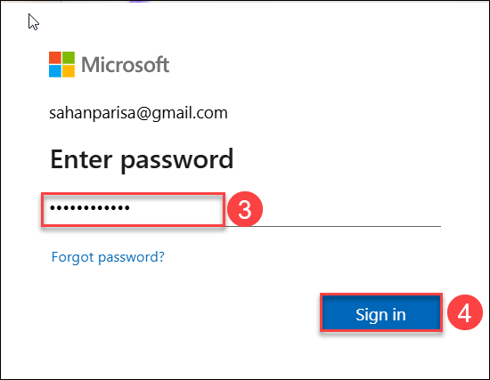
   
### Step 2: Create a Logic App

1. In home page we will be seeing an search bar in that
2. Search for **Logic App** and select **Logic App (Consumption)**

 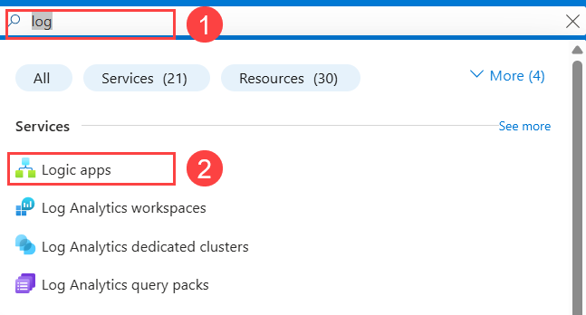
 
3. Click **Create**

 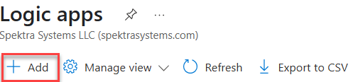
 
4. Fill in the details:

   * **Subscription**: Select your subscription
   * **Resource Group**: Create or select an existing group
   * **Logic App Name**: e.g., `RecurringEmailApp`
   * **Region**: Choose a region close to you
   * **Enable Log Analytics**: Optional
5. Click **Review + Create**, then **Create**

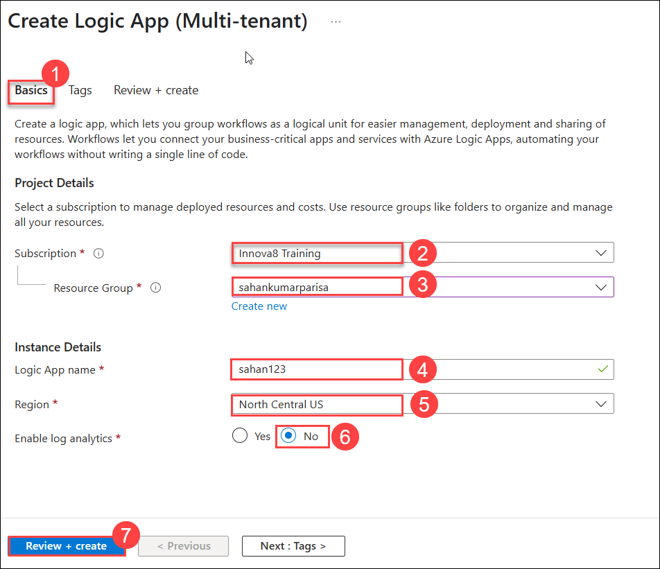

### Step 3: Define the Trigger (Recurrence)

1. Once deployed, click **Go to resource**

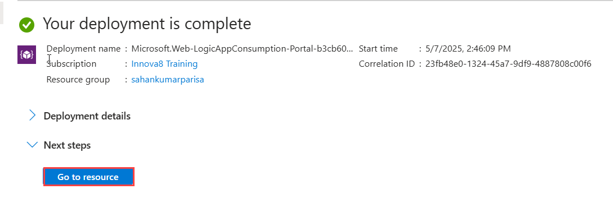

2. In the Logic App Designer, choose **Recurrence** as the trigger

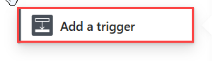

3. Set the interval:

   * **Frequency**: Minute/Hour/Day (e.g., Minute)
   * **Interval**: 5 (for every 5 minutes)

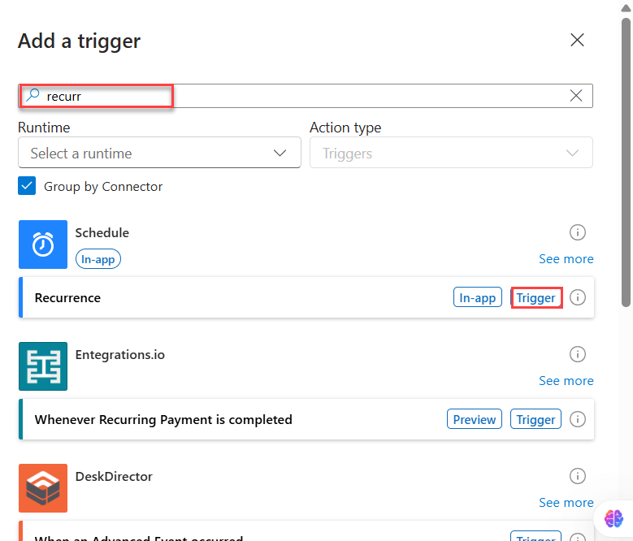

### Step 4: Add Gmail Email Action

1. Click **+ New Step**

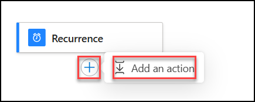

2. Search for **Gmail**

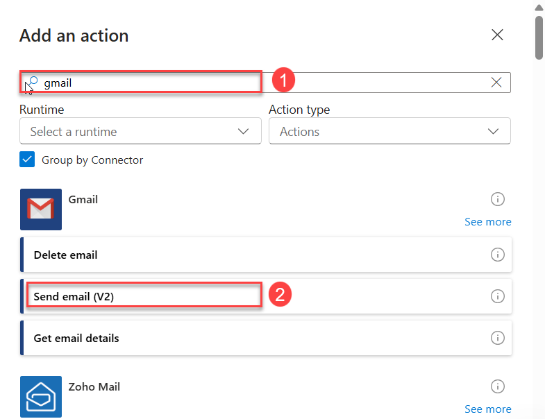

3. Select **Send email (V2)**
4. Sign in with your Gmail account and authorize the connection

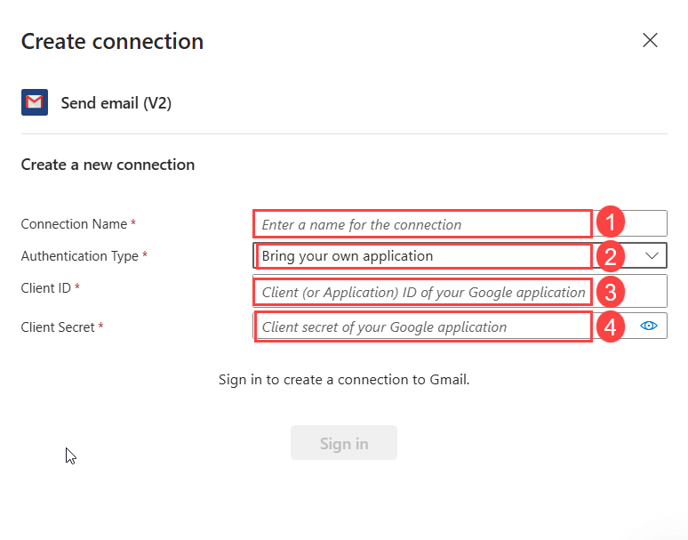

5. Configure the action:

   * **To**: Enter your email address (e.g., `example@gmail.com`)
   * **Subject**: Hello from Azure Logic App
   * **Body**: Hello from Azure

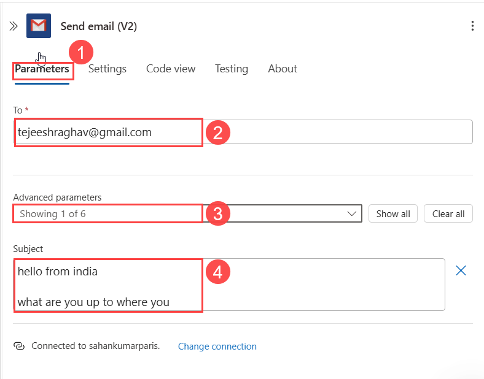

### Step 5: Save and Run

1. Click **Save**
2. Your Logic App is now live and will send an email based on the defined recurrence

### Step 6: Monitor the Run

1. In the Logic App blade, click **Runs history**
2. Check for success/failure of each run
3. Click on individual runs for detailed input/output logs

---

## Summary

You have successfully created a Logic App that triggers on a schedule and sends an email using Gmail. This is useful for automating alerts, reminders, or notifications.

---

## Optional Enhancements

* Add dynamic date/time to the email body
* Log emails to a storage account or database
* Add conditions or branching logic

