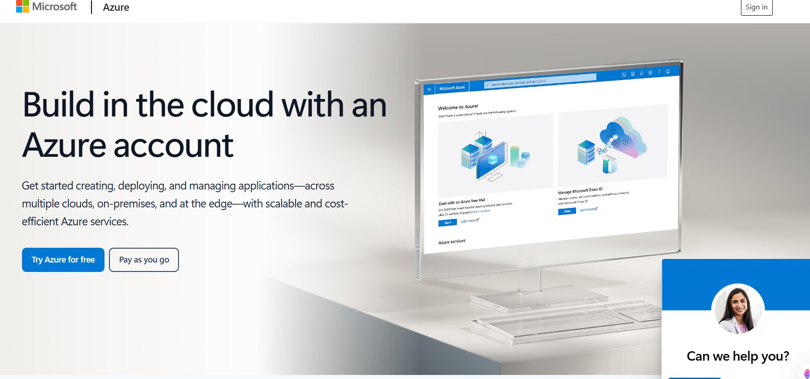
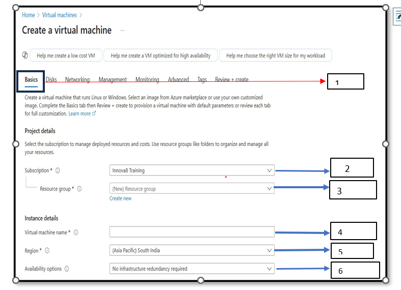

# 🖥️ Create a Simple Virtual Machine on Azure (GUI)

## 🎯 Objective
Creating an virtual machine using the Azure Portal with step-by-step instructions and GUI screenshots.

## 🚀 Steps to Create the VM

### 🔐 1. Sign in to Azure Portal
- Go to: [https://portal.azure.com](https://portal.azure.com)
- Enter your login credentials.

---

### 📦 2. Search for "Virtual Machines"
- On the homepage, use the top search bar and type `Virtual Machines`.
- Click on the result.

---

### ➕ 3. Click “Create” > “Virtual Machine”
- On the Virtual Machines page, click the `+ Create` button.
- Then choose `Azure virtual machine`.

---

### 📝 4. Configure the Basic Settings
- **Subscription**: Select your active subscription.
- **Resource group**: Create new (e.g., `MyVMGroup`) or use an existing one.
- **Virtual machine name**: `MyFirstVM`
- **Region**: Choose closest to your location (e.g., `East US`)
- **Image**: `Windows Server 2019` or `Ubuntu 20.04`
- **Size**: Choose `Standard_B1s` (cheap & basic)
- **Authentication type**: Password or SSH
- **Username**: `azureuser`
- **Password**: Create a strong one

---

### 🌐 5. Configure Networking (Optional)
- Keep default settings or create a new virtual network.
- Ensure Public IP is enabled.
- Allow selected ports (e.g., SSH for Linux or RDP for Windows).
- We dont need to make changes in the monitoring session and mangaement session if you need any you can change that , those are only required for advanced purposes.

---

### ✅ 6. Review + Create
- Click `Next` until you reach the **Review + Create** tab.
- Review all your settings.
- Click the `Create` button.

 -after review and create your virtual machine will be 'deployed' you should go near the resoure in the resource group and click on virtual machine name
 

---

### ⏳ 7. Deployment in Progress
- Azure will begin deploying your VM.
- You’ll see a progress bar and confirmation when done.

---

### 🟢 8. Connect to Your VM
- Go back to the Virtual Machines dashboard.
- Select your VM (`MyFirstVM`).
- Click **Connect** > choose `RDP` (Windows) or `SSH` (Linux).
- Follow the instructions to access your VM.

